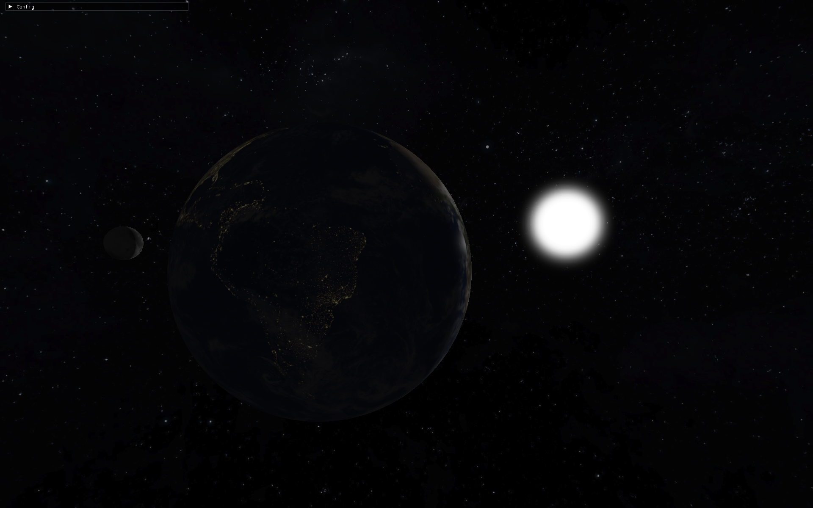
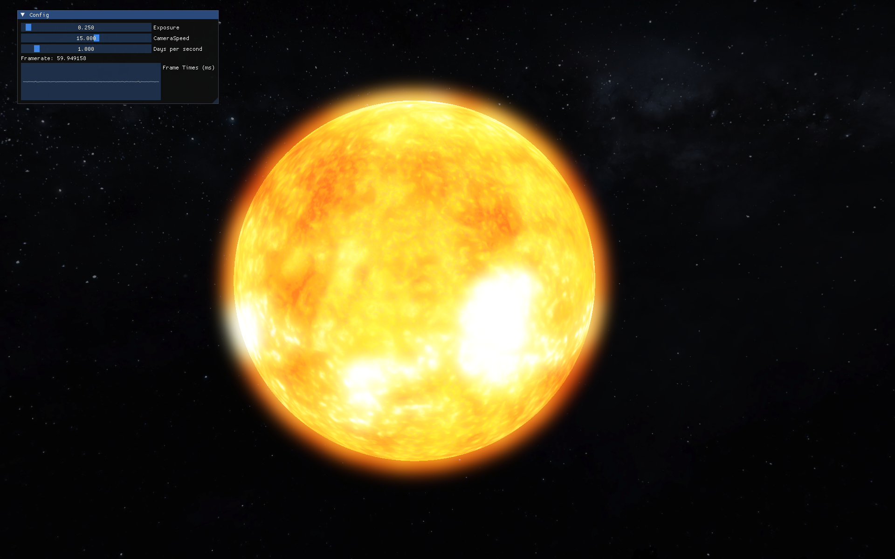
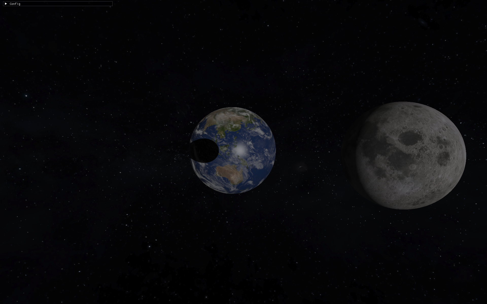
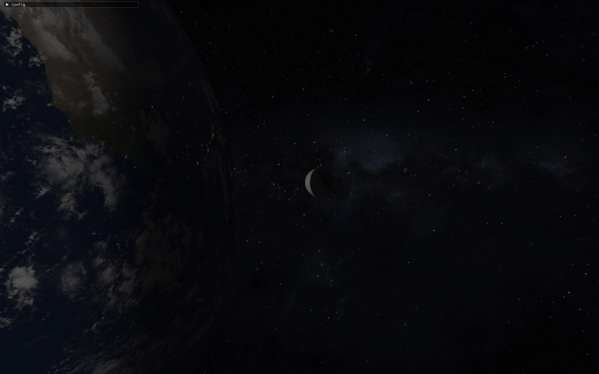

# OpenGL Solar System Renderer

A real-time solar system renderer built from scratch in C++ and OpenGL, featuring an HDR + bloom pipeline, PCF soft shadow mapping with cross-body eclipse shadows, and physically-timed orbital mechanics.



<!--  -->

## Features

- **HDR rendering pipeline** with exposure-based tonemapping
- **Bloom** via multi-pass Gaussian blur on a ping-pong framebuffer pair
- **PCF soft shadow mapping**, shared across bodies — Earth and the Moon can cast shadows on each other (eclipses)
- **Physically-timed orbital mechanics** — real day/year length ratios for spin and orbit speed, correct axial tilt
- **Day/night Earth blending** with specular highlighting and a separately animated cloud layer
- **Skybox** starfield background
- **Free-fly camera** with mouse-look and WASD movement
- **Runtime debug panel** (Dear ImGui) for exposure, camera speed, and simulation time scale

## Screenshots







<!--  -->

## Controls

| Input | Action |
|---|---|
| `W` `A` `S` `D` | Move camera |
| `Space` / `Left Ctrl` | Move up / down |
| Mouse | Look around |
| `Tab` | Toggle cursor lock (frees mouse for the debug panel) |
| `F12` | Screenshot |
| `Esc` | Quit |

## Tech stack

- **Language:** C++
- **Graphics API:** OpenGL 4.2 core profile
- **Windowing / input:** [GLFW](https://www.glfw.org/)
- **OpenGL loader:** [GLEW](http://glew.sourceforge.net/)
- **Math:** [GLM](https://github.com/g-truc/glm)
- **Image loading:** [stb_image](https://github.com/nothings/stb)
- **UI:** [Dear ImGui](https://github.com/ocornut/imgui)

## Architecture

The renderer is split into four sequential passes, each owning its own shaders and framebuffers:

`ShadowPass → ScenePass → BloomPass → FinalPass`

`ShadowPass` renders Earth and the Moon into a shared depth map from the sun's perspective, so either body can shadow the other. `ScenePass` renders the lit scene into an HDR floating-point framebuffer with two color attachments (final color + bright-pass color for bloom). `BloomPass` blurs the bright-pass buffer with a ping-pong Gaussian blur. `FinalPass` composites the HDR and bloom buffers to the screen with exposure tonemapping.

Source is organized by responsibility:
```
src/
├── core/       # windowing, mesh generation, shader compilation
├── rendering/  # the four render passes + the Renderer that chains them
└── scene/      # camera, celestial bodies, simulation/update logic
```

## Building

Currently built and tested on **Windows with MinGW-w64** (`g++`). Required DLLs (GLFW, GLEW) are bundled in the repo.

```bash
git clone https://github.com/Ivan-Brcina/OpenGL-Solar-System-Renderer.git
cd OpenGL-Solar-System-Renderer
make solarSystem
./solarSystem.exe
```

Run it from the repository root — shader and asset paths are relative to the working directory.

Linux/macOS support isn't set up yet (see Roadmap).

## Roadmap / known limitations

- [ ] Cross-platform build (CMake instead of the current Windows-only Makefile)
- [ ] Handle window resize (framebuffers are currently sized once at startup)
- [ ] Normal mapping was attempted but scratched — tangent generation on the UV sphere wasn't producing a visible improvement, but visual artifacts instead, so it wasn't worth the added complexity and therefore was removed for now
- [ ] GPU resource cleanup on shutdown (`glDelete*` calls)

## Asset credits

Planet and moon textures are from [Solar System Scope](https://www.solarsystemscope.com/textures/), licensed under [CC BY 4.0](https://creativecommons.org/licenses/by/4.0/).

